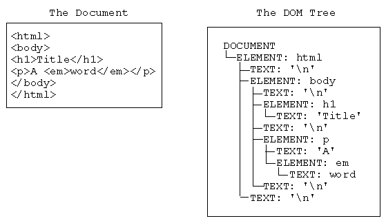
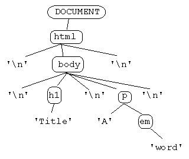

#   SOFTWARE ENGINEERING IMMERSIVE

# The Document Object Model (DOM)

## Learning Objectives (_students will be able to..._)
- Explain the DOM: its value and its structure
- Access DOM Elements using relative selection
- Access DOM Elements using query selectors
- Create, Read (access), Update (content and attributes), and Destroy DOM elements

## Framing (10 minutes)

> Why study JS?

> What does "it runs in the browser" mean? Why is this something that we would want to do?

> We've talked about values (primitive types and objects) and the language constructs for creating our own.

> What is the most annoying thing about websites?

> What is HTML / a Document (in terms of the web) and how do we represent it?

## Introducing the DOM (10 minutes)

JavaScript is the lingua franca of the web. Since it's advent in 1995 as a neat but hastily delivered browser feature from Netscape it has revolutionized the web and by extension the world.
Foundational to the success (existence) of this revolution is a clunky and confusing API called the DOM, the Document Object Model.
The DOM's conception was organic and as its importance grew was standardized.

> NOTE: Keep in mind that the DOM is NOT just whatever is in the HTML!

The DOM is best understood through use so we will waste little time before diving in but if you are interested in a more complete / formalized description, check out [CSS Tricks: What is the DOM?](https://css-tricks.com/dom/) and [MDN Intro to the DOM]( https://developer.mozilla.org/en-US/docs/Web/API/Document_Object_Model/Introduction )

### Representing the Document

The document is the content of our webpage which is encoded into our HTML. The HTML we write is one representation of this.

> What structure does HTML take? (hint: think of parent / child relationships between elements)
> [ hint 2 ](http://hakim.se/experiments/css/domtree/)

An HTML document (like so many other things in programming) is a tree. We will think of it as a tree of elements:

It is important to note though, that there are separate element and text nodes:

We will generally interact with elements and consider the text something belonging to the element but remember to keep in mind actual implementation

## Query Selectors (10 minutes)

Historically the DOM's implementation has been inconsistent across browsers and many of its methods are/were lengthy. This led to the creation of a library called JQuery, which became phenomenally popular due to its ability to patch some annoying parts of JavaScript, and created many methods to assist the interaction with the DOM in the browser. JQuery helped remove lots of boilerplate browser detection schemes, where certain code was only valid in certain browsers. 

> read this: https://blog.garstasio.com/you-dont-need-jquery/why-not/

We're not going to dive into jQuery. Instead, we'll be looking at more modern ways of interacting with the DOM using the free methods provided to us by the DOM.  

## Accessing Element Objects (60 minutes)
When interacting with the DOM, we will primarily be interfacing with element object

The `document` object is exposed on the global object, `window`. This is the top level or root element object.

If you haven't already, clone this repo. Open `docs/index.html` in your browser and open the developer console.

The document has several entry points to the page's content including `.head` and `.body`

### Relative Selection (20 minutes)
There are several properties that every element has which reference the elements proximate to it:

- `.children`
- `.childNodes`
- `.firstChild`
- `.lastChild`
- `.previousSibling`
- `.nextSibling`
- `.parentElement`

 

#### You Do (5 minutes)

Spend a few minutes navigating our simple list using these properties and methods in the console.
Evaluate frequently to keep you bearings and remember to use the up/down arrows to navigate your history.

Use google throughout and talk with your neighbors about confusing parts of documentation. 
Docs are written precisely using sometimes confusing syntax; this is necessary and a good thing but takes some getting used to

### Query Selection (10 minutes)

> Why is relative traversal from the top level an unmaintainable approach to element selection?

Fortunately, we have some much easier method of accessing elements.

#### By Id
`document.getElementById(id)`

#### By Tag
`document.getElementsByTagName(tagName)`

#### By Class
`document.getElementsByClassName(className)`

#### By Selector <-- USE THIS ONE
`document.querySelector(selector)` and `document.querySelectorAll(selector)` use CSS selectors to target elements.

> What's the difference between `querySelector` and `querySelectorAll`?

> Why would we use any of the other selectors?

#### You Do (5 minutes)
Play with that same list, now using query selectors.

As always, discuss what you find with your neighbors -- explaining these ideas in your own words is as valuable as using them

### You Do: Selecting DOM elements (20 minutes)

https://git.generalassemb.ly/sei-nyc-owls/js-dom-quotes-lab

## Manipulating Element Objects (60 minutes)

### Attributes

`element.getAttribute(attr)` / `element.setAttribute(attr, val)`

### Classes

`element.classList`

### Style

`element.style`

### Input Value

`inputElement.value` / `inputElement.value = someValue` 

### Content

`element.innerHTML` / `element.innerHTML = "
 I'm new 
"`

### Creating Elements

`document.createElement(tagName)`

NOTE: this just creates elements but they are not yet on the document!

### Adding Elements

`element.appendChild(newElement)`

> look at the docs for the js method `.innerHTML`. How is it different from the above method?

> Why might we not really like this?

### Removing Elements

`element.removeChild(childElement)`

## Reference
- [MDN DOM](https://developer.mozilla.org/en-US/docs/Web/API/Document_Object_Model/Introduction#Interfaces_and_Objects)
- [Eloquent JS: The Document Object Model](http://eloquentjavascript.net/13_dom.html)
